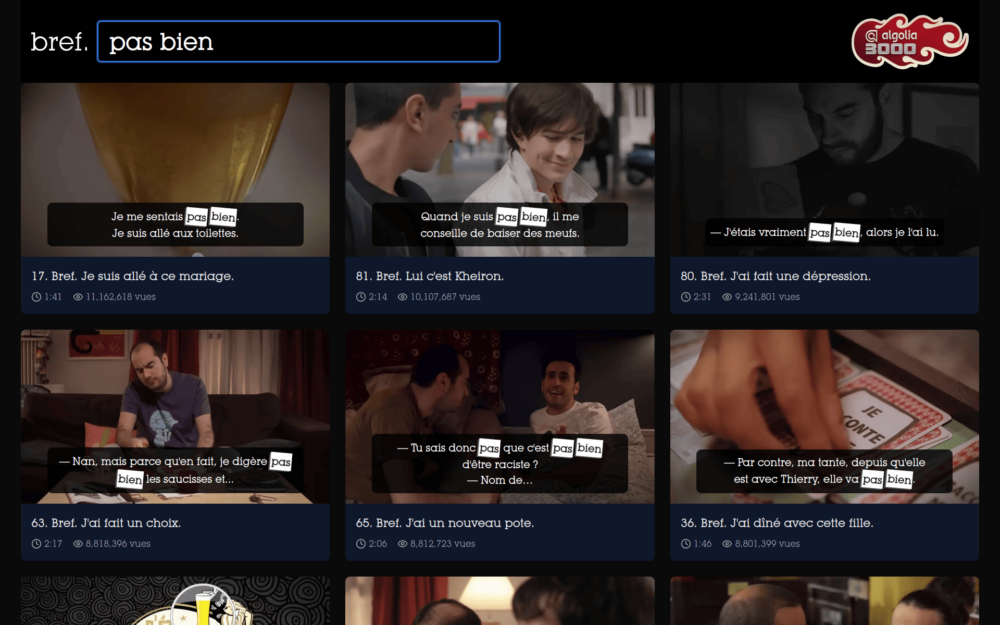

# brefsearch

A searchable interface for the ["Bref" YouTube series](https://www.youtube.com/watch?v=UO8tcf3U0dY&list=PLlFikkv2B2ffwYiFQJmcao3RKtw1DFMz5) powered by Algolia InstantSearch.



## Overview

This website allows users to search through the entire "Bref" video series by dialogue. Search results show relevant video moments with thumbnails and animated previews, making it easy to find specific scenes.

The data processing pipeline (subtitle extraction, thumbnail generation, Algolia indexing) is maintained in a separate repository: [brefsearch-data](https://github.com/algolia/brefsearch-data).

## Features

- **Full-text search** across all episode subtitles
- **Instant results** powered by Algolia
- **Visual previews** with thumbnails and 2-second animated clips
- **Direct YouTube links** to exact timestamps
- **Responsive design** works on all devices
- **Distinct results** showing one result per episode

## Technology Stack

- **Next.js** - React framework with App Router
- **Algolia InstantSearch** - Search UI components
- **Tailwind CSS** - Styling
- **TypeScript** - Type safety
- **Cloudinary** - Image CDN


## Installation

```bash
yarn install
```

## Development

```bash
yarn serve
```

Open [http://localhost:3000](http://localhost:3000) to view the app.

## Building

```bash
yarn build
```

## Linting & Testing

```bash
yarn lint          # Run linter
yarn lint:fix      # Fix linting issues
```

## Configuration

The Algolia search is configured to connect to:
- App ID: `O3F8QXYK6R`
- Index: `brefsearch`
- Search API Key: `6a47b9b62c58a7a4cd2338f095630b15` (public, read-only)

## Search Features

The search interface includes:
- **Default sorting**: Episodes appear in chronological order
- **Search sorting**: Results ranked by popularity and relevance when searching
- **Distinct results**: Only one match per episode shown
- **Popularity**: Episodes ranked by view count, and segments inside of an episode ranked by most replayed.

## Deployment

The site is deployed on Netlify. Configuration is in `netlify.toml`.

## Related Repositories

- [brefsearch-data](https://github.com/algolia/brefsearch-data) - Data processing scripts for subtitle extraction and indexing
- [brefsearch-images](https://github.com/pixelastic/brefsearch-images) - Media assets (thumbnails and animated previews)

## Thanks

- [@lukyvj](https://bsky.app/profile/lukyvj.bsky.social) for the front-end
- [@sarahdayan](https://bsky.app/profile/sarahdayan.com) for the subtitle best practices
- [@fluf22](https://github.com/fluf22) for the video compression tips

## License

MIT
